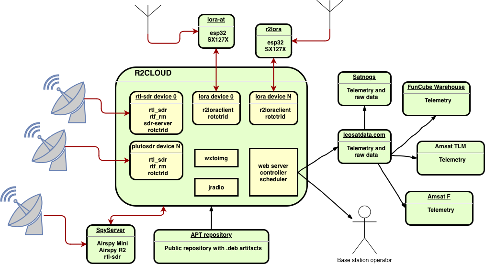

## About [](https://travis-ci.org/dernasherbrezon/r2cloud) [](https://sonarcloud.io/dashboard?id=ru.r2cloud%3Ar2cloud) [](https://snyk.io/test/github/dernasherbrezon/r2cloud) [](https://gitter.im/r2cloud/Lobby)

r2cloud can track and decode various radio signals from satellites such as:

  - APT (weather satellite)
  - LRPT (weather satellite)
  - Cubesats (FSK, BPSK, QPSK, AFSK, AX.25, AX100 &etc)
 
## Screenshots ([r2cloud-ui](https://github.com/dernasherbrezon/r2cloud-ui)) 

&nbsp;&nbsp;&nbsp;&nbsp;
 
## Principal diagram



## Assemble base station

Base station might include different hardware components. Please check recommended [bill of materials](https://github.com/dernasherbrezon/r2cloud/wiki/Bill-of-materials). This is very basic setup, but it is guaranteed to be working.

## Installation 

1. Install r2cloud
  - From the image. This is the easiest way to install r2cloud on Raspberry PI. It will require brand new SD card:
    - Download the [latest](https://s3.amazonaws.com/r2cloud/dist/image_2020-08-13-r2cloud-lite.zip) official image
    - Insert SD card into the card reader and flash it. You could use [Etcher](https://etcher.io) to do this
    - Insert SD card into the card reader and create file ```r2cloud.txt``` in the root directory. This file should contain any random string. This string is a login token. This token will be used during initial setup.
  
  - Or from repository binaries:
    - Login via SSH and create ```r2cloud.txt``` file in /boot directory. This file should contain any random string. This string is a login token. This token will be used during initial setup.
    - Execute the following commands:
```
sudo apt-get install dirmngr lsb-release
sudo apt-key adv --keyserver keyserver.ubuntu.com --recv-keys A5A70917
sudo bash -c "echo 'deb http://s3.amazonaws.com/r2cloud $(lsb_release --codename --short) main' > /etc/apt/sources.list.d/r2cloud.list"
sudo apt-get update
sudo apt-get install r2cloud
```
2. Open [https://raspberrypi.local](https://raspberrypi.local) address.
3. Accept self-signed certificate. This is unique certificate that was generated during installation. Once setup is complete, you could enable proper SSL using [Letsencrypt](https://letsencrypt.org). 

## Design guidelines

  - Autonomous:
    - Ability to operate without internet connection
    - synchronize state once connection restored
    - automatically calibrate average absolute error
    - configure base station location based on coordinates from GPS receiver
    - new decoders could be added after auto-update
  - Integration with external systems:
    - share as much as possible data with external systems
    - re-use libraries
  - Single stack
    - focus on single hardware and software stack
    - optimize it
  - Stability
    - housekeeping logs and data based on available hard disk
    - auto-update
    - backward compatibility
  - Security
    - safe to expose administration UI to the internet
   
Details could be found in official [documentation](https://github.com/dernasherbrezon/r2cloud/wiki/Features).

## Contribution

Please read our [guidelines](https://github.com/dernasherbrezon/r2cloud/wiki/Contribution).

## Contact

Please use [gitter](https://gitter.im/r2cloud/Lobby)

## Troubleshooting guide

Frequent errors are combined in our [guide](https://github.com/dernasherbrezon/r2cloud/wiki/Troubleshooting-guide).

