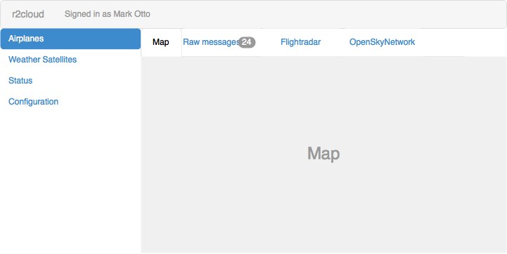
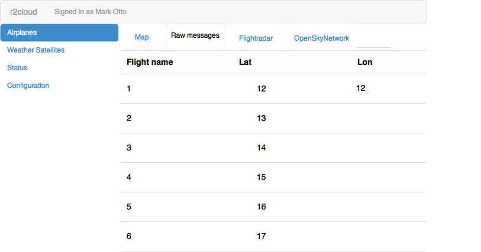

# About

r2cloud converts Raspberry PI into base station which support various radio signals, such as:

 - ADS-B (airplane)
 - APT (weather satellite)
 - 2FSK telemetry demodulation for various cubesats
 
# Principal diagram

# Core features

 - Autonomous:
   * Ability to operate without internet connection
   * synchronize state once connection restored
   * automatically calibrate average absolute error
   * configure base station location based on coordinates from GPS receiver
   * new decoders could be added after auto-update
 - Integration with external systems:
   * share as much as possible data with external systems
   * re-use libraries
 - Single stack
   * focus on single hardware and software stack
   * optimize it
 - Stability
   * housekeeping logs and data based on available hard disk
   * auto-update
   * backward compatibility
 - Security
   * safe to expose administration UI to the internet
   
# Features detailed

### Configuration

 - base station lat and lon
 - single user - "admin":
   * password
   * email to send notifications to
 - last kalibrated average absolute error
 - integration settings
 
### Distribution

 - base image with pre-installed components could be downloaded from r2cloud.ru
 - further updates will be auto downloaded from shared apt repository
 
### Web UI

 - single admin user
 - on first access configuration wizard will be executed:
   1) user will be promted for new password
   2) if no GPS attached, then ask user for lat and lon. If GPS attached and coordinates could be read, then skip this step
   3) Ask for domain name to access externally. Could be skipped.

### SSL

 - User could setup hostname for external access during first access or in `Settings` menu later
 - Without SSL configured, all external requests will be forwarded to error page with instruction on how to configure SSL first (this include login page)
 - Local requests (from the same subnet) will work
 - If host specified, then [Let's Encrypt](https://letsencrypt.org) certificate will be issued
   * certbot output should be proxied to the UI
   * certbot auto-renew should be added to the cron to be executed weekly

### Housekeeping

 - rotate logs: daily
 - keep logs: gzipped for the last 30 days

### Status

 - monitor status:
   * CPU
   * RAM total, RAM used
   * Disk total, disk used
   * Temperature (using '/opt/vc/bin/vcgencmd measure_temp' command)
   * Load average 1m
 - draw time-based charts:
   * last hour, week, month
 - show log
   * log file will be rotated daily, old logs gzipped and stored for 1 month

# Integrations

 - if internet is not available, then data will be stored locally with configured retension period
 - once internet connection restored, data will be uploaded

### Flightradar 

# Technologies

 - web ui: 
   * Java SE Embedded profile compact1
   * Web server: [nanohttpd](https://github.com/NanoHttpd/nanohttpd)
   * Templating engine: [freemarker](http://freemarker.org)
   * SSL termination: [nginx](https://www.nginx.com)
   * SSL: [Let's Encrypt](https://letsencrypt.org)
 - ADS-B decoder: [dump1090](https://github.com/MalcolmRobb/dump1090)
 - APT: [wxtoimg](http://www.wxtoimg.com)
 - RTL-SDR: [rtl-sdr](http://osmocom.org/projects/sdr/wiki/rtl-sdr)
 - average absolute error detector: [kalibrate](https://github.com/steve-m/kalibrate-rtl)
 - logging: java.util.logging
 - log rotation: [logrotate](https://github.com/logrotate/logrotate)
